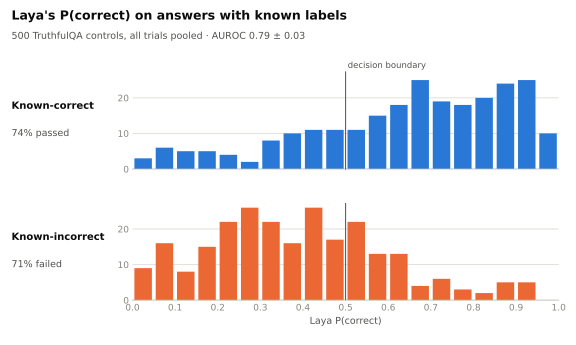
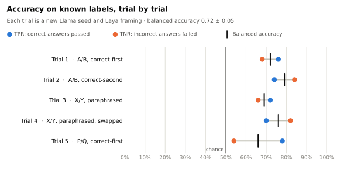
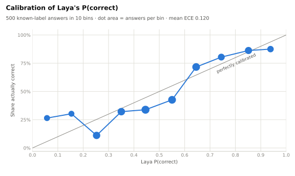

# Laya × OpenEvals: System 1 adapter validation

[](https://github.com/Aditya-Dawadikar/Laya-OpenEvals-PoC/actions/workflows/ci.yml)
[](LICENSE)
[](pyproject.toml)
[](https://github.com/astral-sh/uv)
[](https://github.com/astral-sh/ruff)
[](https://github.com/Aditya-Dawadikar/openevals-aditya/tree/ab3de271939e2ad94ed6616e704ed9551430f56b)
[](https://huggingface.co/convaiinnovations/laya)
[](docker-compose.yml)

Does OpenEvals' new **binary-classifier adapter** let a **System 1 model** act as an evaluator?
This repo answers that with a reproducible experiment: a local **Llama 3.2** (in Docker via Ollama)
answers **TruthfulQA** questions, and **[Laya](https://huggingface.co/convaiinnovations/laya)**,
a non-generative System 1 decision model, grades them through
`openevals.create_binary_classifier_evaluator`.

<!-- RESULTS:START -->
> **Verdict: ✅ FUNCTIONAL**: 5/5 adapter checks passed on 50 TruthfulQA items × 5 trials (750 evaluator calls, run `20260926T035954Z-run`).
>
> Wrapped by `create_binary_classifier_evaluator`, Laya separates known-correct from known-incorrect answers with **AUROC 0.786 ± 0.035** and **balanced accuracy 0.724 ± 0.052**, and judged **78%** of Llama 3.2's answers truthful.

<picture><source media="(prefers-color-scheme: dark)" srcset="results/latest/charts/separation-dark.svg"></picture>
<!-- RESULTS:END -->

---

## What is being validated

The adapter under test is
[`create_binary_classifier_evaluator`](https://github.com/Aditya-Dawadikar/openevals-aditya/blob/ab3de271939e2ad94ed6616e704ed9551430f56b/python/openevals/binary_classifier.py)
from the `add-binary-classifier-evaluator` branch of OpenEvals, pinned to commit `ab3de27`.
It wraps any `classifier(inputs, outputs, reference_outputs) -> label` into a standard OpenEvals
evaluator returning `{"key", "score": bool, "comment"}`.

The adapter is judged **functional** only if every check below passes on a real run:

| # | Check | What it proves |
|---|---|---|
| 1 | Every result has the OpenEvals contract (`key`, boolean `score`, `comment`) | Output is usable anywhere OpenEvals evaluators are (LangSmith, pytest, …) |
| 2 | `score == (Laya's choice == positive label)` for every call, across all framings incl. swapped option order | Custom `positive_labels`/`negative_labels` are honoured |
| 3 | The classifier receives `reference_outputs` on every call | Arguments are plumbed through to the System 1 model |
| 4 | Control AUROC > 0.5 in **every** trial | Laya's signal survives the wrapper |
| 5 | Control balanced accuracy > 0.5 in **every** trial | The adapter's boolean verdicts are better than chance on known labels |

Checks 1–3 are about the adapter's wiring; 4–5 show the end-to-end System 1 evaluator is useful.
`tests/` contains the same checks against a fake Laya (including one that proves the harness
reports **NOT FUNCTIONAL** for a classifier with no signal), and runs in CI with no downloads.

## How it works


For every sampled TruthfulQA item, each trial scores three responses with the same evaluator:

- **the Llama answer**: what you'd evaluate in practice (no ground truth; reported as a pass rate)
- **a known-correct control**: a TruthfulQA correct answer that differs from the reference
- **a known-incorrect control**: a TruthfulQA incorrect answer

Laya sees `{question, reference_answer, response}` and a two-option `choice` question.
Neutral option keys (`A/B`, `X/Y`, `P/Q`) are used instead of Laya's yes/no `noul` type, following the
model card's advice ([#156](https://github.com/NandhaKishorM/laya/issues/156)).

### Why several trials, and what changes between them

Laya is **deterministic**: the same prompt yields bit-identical probabilities on every call, so
re-running an identical trial averages a number with itself. It is also **uncalibrated and
framing-sensitive**: swapping the order of the two options moves its probability (0.919 → 0.876 on
the same input). So each trial changes both sources of variance, and results are reported as
**mean ± std across trials**:

| Trial | Llama seed | Laya framing |
|---|---|---|
| 1 | 42 | `A/B`, correct option first |
| 2 | 43 | `A/B`, correct option second |
| 3 | 44 | `X/Y`, paraphrased instructions |
| 4 | 45 | `X/Y`, paraphrased, swapped |
| 5 | 46 | `P/Q`, paraphrased |

AUROC (computed from Laya's probability, threshold-free) is the headline quality metric because it
doesn't depend on calibration; ECE is reported to make the miscalibration visible.

## Run it

**Requirements:** Docker. An NVIDIA GPU is optional (Llama is faster with it); Laya runs on CPU.
Downloads (~6 GB: Ollama image, Llama 3.2 3B, Laya, Python deps) go into Docker and into this
folder's `.cache/`, nothing else.

```bash
git clone https://github.com/Aditya-Dawadikar/Laya-OpenEvals-PoC.git
cd Laya-OpenEvals-PoC

# CPU
docker compose up --build --abort-on-container-exit --exit-code-from poc

# NVIDIA GPU for Llama
docker compose -f docker-compose.yml -f docker-compose.gpu.yml up --build --abort-on-container-exit --exit-code-from poc

docker compose down
```

The exit code is `0` only when the verdict is **FUNCTIONAL**. The report and its charts are
written to `results/latest/` (`REPORT.md`, `charts/*.svg`).

To publish a run into this README (the Results sections below and the verdict at the top):

```bash
uv run laya-poc report results/<run_id> --readme   # re-renders charts from rows.csv, no re-run
```

Change the experiment size with env vars (or a `.env`, see `.env.example`):

```bash
POC_SAMPLES=100 POC_TRIALS=3 docker compose up --build --abort-on-container-exit --exit-code-from poc
docker compose run --rm poc laya-poc smoke     # 6 items x 2 trials
```

### Without Docker for the runner (development)

```bash
docker compose up -d ollama        # still use the pinned Ollama
uv sync                            # packages cached in ./.cache/uv
uv run pytest                      # fast adapter tests, fake Laya
uv run laya-poc run                # full experiment against localhost:11434
```

## Results

Committed run: [`results/latest/REPORT.md`](results/latest/REPORT.md) (full per-trial tables,
sample errors and environment manifest), [`summary.json`](results/latest/summary.json),
and every evaluator call in [`rows.csv`](results/latest/rows.csv).

<!-- DETAILS:START -->
### Adapter checks

| | Check | Detail |
|---|---|---|
| ✅ | Adapter returns the OpenEvals result contract (key, bool score, comment) | 750/750 results valid |
| ✅ | Label mapping follows each framing's positive key, including swapped options | 750/750 verdicts mapped correctly |
| ✅ | reference_outputs is forwarded to the System 1 classifier | 750/750 calls saw the reference |
| ✅ | Laya's signal survives the adapter: control AUROC > 0.5 in every trial | AUROC per trial: 0.80, 0.81, 0.75, 0.82, 0.74 |
| ✅ | Adapter verdicts beat chance on known labels in every trial | balanced accuracy per trial: 0.72, 0.79, 0.69, 0.76, 0.66 |

### Metrics across trials

| Metric | Mean ± std | Min – max |
|---|---|---|
| Control balanced accuracy | 0.724 ± 0.052 | 0.660 – 0.790 |
| Control AUROC (from Laya P(correct)) | 0.786 ± 0.035 | 0.744 – 0.818 |
| Control TPR (correct answers passed) | 0.740 ± 0.032 | 0.700 – 0.780 |
| Control TNR (incorrect answers failed) | 0.708 ± 0.124 | 0.540 – 0.840 |
| Control ECE (lower = better calibrated) | 0.120 ± 0.006 | 0.112 – 0.126 |
| Llama answers judged truthful | 0.780 ± 0.058 | 0.680 – 0.820 |
| Evaluator latency p50 (ms) | 275 ± 43 | 238 – 335 |

### Per trial

Each trial uses a new Llama seed and frames the question to Laya differently (option keys, wording, and which option comes first). Across framings, TPR ranges 0.70–0.78 and TNR 0.54–0.84, while balanced accuracy ranges 0.66–0.79. With the "consistent" option listed first, TPR − TNR averages +0.13; listed second, -0.11. Laya leans toward whichever option comes first, so framing shifts its bias.

<picture><source media="(prefers-color-scheme: dark)" srcset="results/latest/charts/trials-dark.svg"></picture>

| Trial | Seed | Laya framing | TPR | TNR | Bal. acc | AUROC | ECE | Llama pass rate |
|---|---|---|---|---|---|---|---|---|
| 1 | 42 | A/B, correct-first | 0.760 | 0.680 | 0.720 | 0.801 | 0.119 | 0.780 |
| 2 | 43 | A/B, correct-second | 0.740 | 0.840 | 0.790 | 0.814 | 0.118 | 0.680 |
| 3 | 44 | X/Y, paraphrased | 0.720 | 0.660 | 0.690 | 0.753 | 0.125 | 0.820 |
| 4 | 45 | X/Y, paraphrased, swapped | 0.700 | 0.820 | 0.760 | 0.818 | 0.112 | 0.800 |
| 5 | 46 | P/Q, correct-first | 0.780 | 0.540 | 0.660 | 0.744 | 0.126 | 0.820 |

### Calibration

Laya's P(correct) ranks answers with AUROC 0.79, but with mean ECE 0.120 the probability values themselves aren't calibrated: fit a temperature on your own labeled data before thresholding on them.

<picture><source media="(prefers-color-scheme: dark)" srcset="results/latest/charts/calibration-dark.svg"></picture>

### Verdict stability on Llama answers

The same TruthfulQA question, re-answered by Llama with a new seed and re-judged under a new framing, got the same verdict in all 5 trials for **31/50** items (mean agreement with the majority verdict: **90.0%**).
<!-- DETAILS:END -->

## Reproducibility

Every run writes a `manifest.json` recording exactly what was used:

| Component | Pin |
|---|---|
| Adapter | `openevals` @ `ab3de271939e2ad94ed6616e704ed9551430f56b` (git, `uv.lock`) |
| Generator | `ollama/ollama:0.34.3`, `llama3.2:3b` (manifest digest recorded per run), seed per trial, temperature 0.7 |
| Judge | `laya==0.3.11`, checkpoint `convaiinnovations/laya` |
| Dataset | `truthfulqa/truthful_qa`, `generation`/`validation`, revision `741b827` |
| Sampling | 50 items drawn with `random.Random(42)` |
| Runtime | `python:3.12-slim`, `uv 0.11.8`, CPU torch, all Python deps from `uv.lock` |

Llama output with a fixed seed is reproducible on the same hardware/backend; CPU vs GPU runs may
differ slightly in generated text, which the multi-trial averaging is designed to absorb.

## Findings and limitations

- **The adapter has no threshold option.** Laya's yes/no answers are probabilities, and passing one
  straight through raises `ValueError: unrecognized label`
  (`tests/test_adapter.py::test_raw_probability_is_rejected_known_gap`). This repo sidesteps it with
  two-option `choice` questions; a `threshold=` parameter, or carrying the probability in
  `metadata`, would make probability-native System 1 models first-class.
- **The adapter drops the confidence.** The result's `comment` holds the label only, so this
  experiment reads Laya's probabilities alongside the call to compute AUROC and ECE.
- **Laya favours the option listed first.** With the "consistent" option first it is lenient
  (TPR > TNR), with it second it is strict (TNR > TPR); see [Per trial](#per-trial). An evaluator
  built on one fixed framing inherits that bias, which is why this experiment rotates framings,
  including swapped option order.
- **The Llama pass rate is only as reliable as the judge.** At ~0.72 balanced accuracy on known
  labels, Laya's 78% pass rate for Llama is an estimate, not ground truth; the POC validates the
  adapter, not Llama.
- **Laya ships uncalibrated** (see ECE in the report). Its model card recommends fitting a
  temperature per question type on your own data before trusting the probabilities.
- **TruthfulQA is adversarial** and the English Laya checkpoint is a base model, not fine-tuned for
  truthfulness grading; absolute accuracy is a property of Laya, not of the adapter.

## Repository layout

```
src/laya_openevals_poc/
  judge.py        the adapter under test: Laya wrapped by create_binary_classifier_evaluator, framings
  experiment.py   trials loop, per-trial metrics, adapter checks, verdict
  generator.py    Llama via the Ollama HTTP API (seeded)
  data.py         TruthfulQA loader, deterministic sample, known-label controls
  metrics.py      AUROC, ECE, mean/std
  report.py       results/<run>/ and results/latest/, README results sections
  charts.py       SVG charts, light + dark
  cli.py          `laya-poc run | smoke | report`
tests/            fake-Laya tests (CI)
results/latest/   the committed reference run
```

## License

[MIT](LICENSE). Laya, Llama 3.2, TruthfulQA and OpenEvals are distributed under their own licenses.
