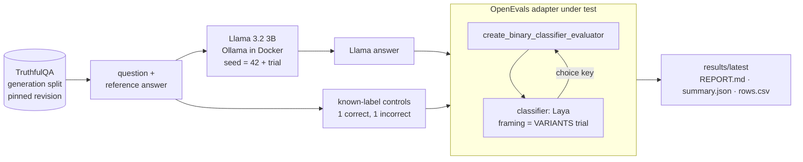

# Laya × OpenEvals: System 1 adapter validation

Does OpenEvals' new **binary-classifier adapter** let a **System 1 model** act as an evaluator?
This repo answers that with a reproducible experiment: a local **Llama 3.2** (in Docker via Ollama)
answers **TruthfulQA** questions, and **[Laya](https://huggingface.co/convaiinnovations/laya)**,
a non-generative System 1 decision model, grades them through
`openevals.create_binary_classifier_evaluator`.

<!-- RESULTS:START -->
> **Verdict: _pending first full run_** — run `docker compose up` (below) to produce `results/latest/REPORT.md`.
<!-- RESULTS:END -->

---

## What is being validated

The adapter under test is
[`create_binary_classifier_evaluator`](https://github.com/Aditya-Dawadikar/openevals-aditya/blob/ab3de271939e2ad94ed6616e704ed9551430f56b/python/openevals/binary_classifier.py)
from the `add-binary-classifier-evaluator` branch of OpenEvals, pinned to commit `ab3de27`.
It wraps any `classifier(inputs, outputs, reference_outputs) -> label` into a standard OpenEvals
evaluator returning `{"key", "score": bool, "comment"}`.

The adapter is judged **functional** only if every check below passes on a real run:

| # | Check | What it proves |
|---|---|---|
| 1 | Every result has the OpenEvals contract (`key`, boolean `score`, `comment`) | Output is usable anywhere OpenEvals evaluators are (LangSmith, pytest, …) |
| 2 | `score == (Laya's choice == positive label)` for every call, across all framings incl. swapped option order | Custom `positive_labels`/`negative_labels` are honoured |
| 3 | The classifier receives `reference_outputs` on every call | Arguments are plumbed through to the System 1 model |
| 4 | Control AUROC > 0.5 in **every** trial | Laya's signal survives the wrapper |
| 5 | Control balanced accuracy > 0.5 in **every** trial | The adapter's boolean verdicts are better than chance on known labels |

Checks 1–3 are about the adapter's wiring; 4–5 show the end-to-end System 1 evaluator is useful.
`tests/` contains the same checks against a fake Laya (including one that proves the harness
reports **NOT FUNCTIONAL** for a classifier with no signal), and runs in CI with no downloads.

## How it works



For every sampled TruthfulQA item, each trial scores three responses with the same evaluator:

- **the Llama answer**: what you'd evaluate in practice (no ground truth; reported as a pass rate)
- **a known-correct control**: a TruthfulQA correct answer that differs from the reference
- **a known-incorrect control**: a TruthfulQA incorrect answer

Laya sees `{question, reference_answer, response}` and a two-option `choice` question.
Neutral option keys (`A/B`, `X/Y`, `P/Q`) are used instead of Laya's yes/no `noul` type, following the
model card's advice ([#156](https://github.com/NandhaKishorM/laya/issues/156)).

### Why several trials, and what changes between them

Laya is **deterministic**: the same prompt yields bit-identical probabilities on every call, so
re-running an identical trial averages a number with itself. It is also **uncalibrated and
framing-sensitive**: swapping the order of the two options moves its probability (0.919 → 0.876 on
the same input). So each trial changes both sources of variance, and results are reported as
**mean ± std across trials**:

| Trial | Llama seed | Laya framing |
|---|---|---|
| 1 | 42 | `A/B`, correct option first |
| 2 | 43 | `A/B`, correct option second |
| 3 | 44 | `X/Y`, paraphrased instructions |
| 4 | 45 | `X/Y`, paraphrased, swapped |
| 5 | 46 | `P/Q`, paraphrased |

AUROC (computed from Laya's probability, threshold-free) is the headline quality metric because it
doesn't depend on calibration; ECE is reported to make the miscalibration visible.

## Run it

**Requirements:** Docker. An NVIDIA GPU is optional (Llama is faster with it); Laya runs on CPU.
Downloads (~6 GB: Ollama image, Llama 3.2 3B, Laya, Python deps) go into Docker and into this
folder's `.cache/`, nothing else.

```bash
git clone https://github.com/Aditya-Dawadikar/Laya-OpenEvals-PoC.git
cd Laya-OpenEvals-PoC

# CPU
docker compose up --build --abort-on-container-exit --exit-code-from poc

# NVIDIA GPU for Llama
docker compose -f docker-compose.yml -f docker-compose.gpu.yml up --build --abort-on-container-exit --exit-code-from poc

docker compose down
```

The exit code is `0` only when the verdict is **FUNCTIONAL**. The report is written to
`results/latest/REPORT.md`.

Change the experiment size with env vars (or a `.env`, see `.env.example`):

```bash
POC_SAMPLES=100 POC_TRIALS=3 docker compose up --build --abort-on-container-exit --exit-code-from poc
docker compose run --rm poc laya-poc smoke     # 6 items x 2 trials
```

### Without Docker for the runner (development)

```bash
docker compose up -d ollama        # still use the pinned Ollama
uv sync                            # packages cached in ./.cache/uv
uv run pytest                      # fast adapter tests, fake Laya
uv run laya-poc run                # full experiment against localhost:11434
```

## Results

Committed run: [`results/latest/REPORT.md`](results/latest/REPORT.md) (full per-trial tables,
sample errors and environment manifest), [`summary.json`](results/latest/summary.json),
and every evaluator call in [`rows.csv`](results/latest/rows.csv).

<!-- DETAILS:START -->
_Populated after the first full run._
<!-- DETAILS:END -->

## Reproducibility

Every run writes a `manifest.json` recording exactly what was used:

| Component | Pin |
|---|---|
| Adapter | `openevals` @ `ab3de271939e2ad94ed6616e704ed9551430f56b` (git, `uv.lock`) |
| Generator | `ollama/ollama:0.34.3`, `llama3.2:3b` (manifest digest recorded per run), seed per trial, temperature 0.7 |
| Judge | `laya==0.3.11`, checkpoint `convaiinnovations/laya` |
| Dataset | `truthfulqa/truthful_qa`, `generation`/`validation`, revision `741b827` |
| Sampling | 50 items drawn with `random.Random(42)` |
| Runtime | `python:3.12-slim`, `uv 0.11.8`, CPU torch, all Python deps from `uv.lock` |

Llama output with a fixed seed is reproducible on the same hardware/backend; CPU vs GPU runs may
differ slightly in generated text, which the multi-trial averaging is designed to absorb.

## Findings and limitations

- **The adapter has no threshold option.** Laya's yes/no answers are probabilities, and passing one
  straight through raises `ValueError: unrecognized label`
  (`tests/test_adapter.py::test_raw_probability_is_rejected_known_gap`). This repo sidesteps it with
  two-option `choice` questions; a `threshold=` parameter, or carrying the probability in
  `metadata`, would make probability-native System 1 models first-class.
- **The adapter drops the confidence.** The result's `comment` holds the label only, so this
  experiment reads Laya's probabilities alongside the call to compute AUROC and ECE.
- **Laya ships uncalibrated** (see ECE in the report). Its model card recommends fitting a
  temperature per question type on your own data before trusting the probabilities.
- **TruthfulQA is adversarial** and the English Laya checkpoint is a base model, not fine-tuned for
  truthfulness grading; absolute accuracy is a property of Laya, not of the adapter.

## Repository layout

```
src/laya_openevals_poc/
  judge.py        the adapter under test: Laya wrapped by create_binary_classifier_evaluator, framings
  experiment.py   trials loop, per-trial metrics, adapter checks, verdict
  generator.py    Llama via the Ollama HTTP API (seeded)
  data.py         TruthfulQA loader, deterministic sample, known-label controls
  metrics.py      AUROC, ECE, mean/std
  report.py       results/<run>/ and results/latest/
  cli.py          `laya-poc run | smoke`
tests/            fake-Laya tests (CI)
results/latest/   the committed reference run
```
